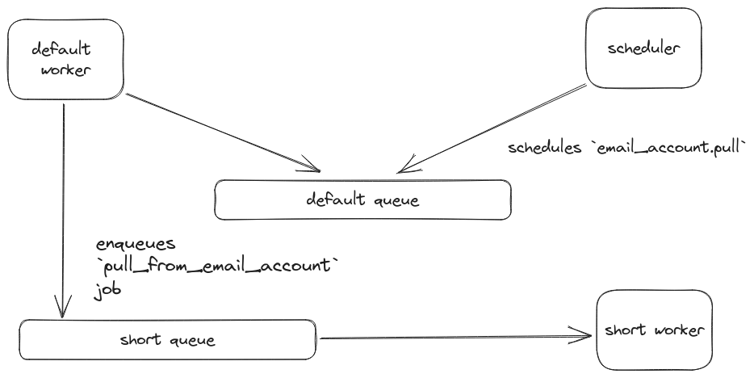

# Email Architecture

This document describes the high-level architecture of how emails work in appyframe.

> NOTE: There are mentions of different types of workers to execute jobs from different types of queues in the explanations below, however only a single type of worker can also be used to do the same.

### High-Level View

#### Pulling/Sending:

The same follows for email sending with the only difference being in the jobs queued.

The scheduler schedules/pushes the `email.pull`/`queue.flush` job into the default queue which is picked up by the default worker and upon execution enqueues `pull_from_email_account`/`send_mail` job into the short queue and the job is then picked up by the short worker and the email is pulled in/sent out of the system.

### Code Map

This section talks briefly about various important directories/files.

#### `doctype/email_queue`

Contains all logic about email sending. Every email to be sent is stored in `Email Queue` DocType (Newsletter(s) included).

#### `receive.py`

Contains all the logic and classes about email receiving.

#### `doctype/email_account`

Contains logic for validating connection/auth for email account(s).

Also, contains the abstraction for facilitating email receiving.

#### `doctype/newsletter`

Contains all the logic about newsletter scheduling, subscribing and unsubscribing.

Newsletter has a similar design as to how normal emails are sent except for the initial scheduled job (`newsletter.send_scheduled_email`) and the fact that newsletter recipients are batched, primarily for SMTP connection reusing & mitigating any potential timeouts (available as a general feature as well).

Each batch is queued as a separate job (`QueueBuilder.send_emails`) into the long queue by the default worker which is then picked up by the long worker.

#### `doctype/notification`

Contains all logic about handling various types of notifications by the system.

#### `email_body.py`

Contains logic about creating the email body. We use Python's email std lib for body generation.

The email message format/syntax is described in [RFC5322](https://datatracker.ietf.org/doc/html/rfc5322)

### Observability

At the application level,

`RQ Job` DocType is the most useful in knowing the status of any type of "recent" email job (pull/send).

`Email Queue` DocType is self-contained and stores all the errored out (along with traceback) as well as the sent/partially sent mails from the system.

`Communication` DocType stores all the successfully received emails and `Unhandled Email` DocType stores all the "unhandled" ones during receiving.

Apart from these, the `Error Log` DocType also comes into help from time to time.
